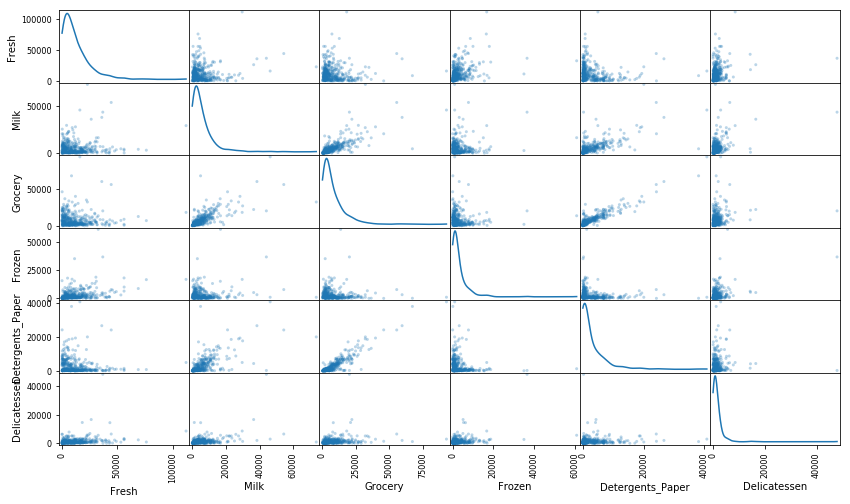
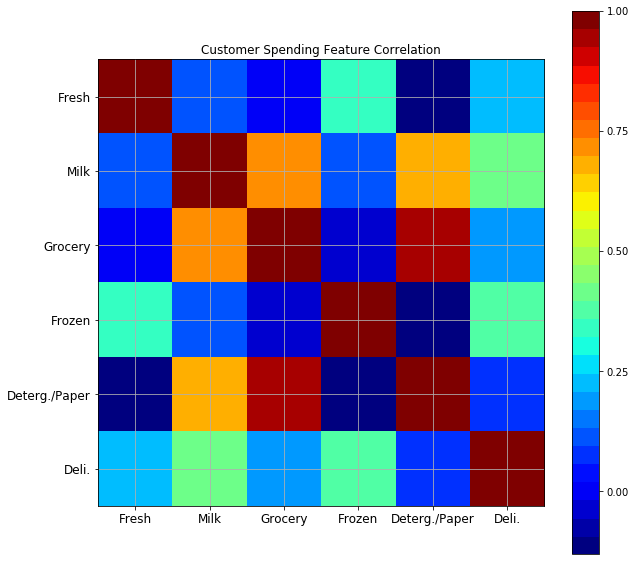
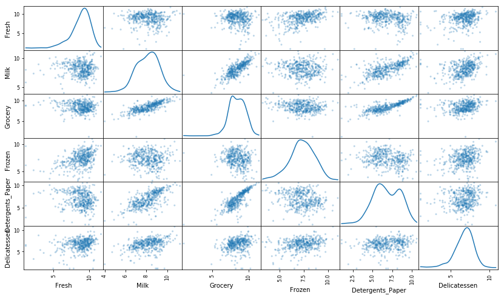
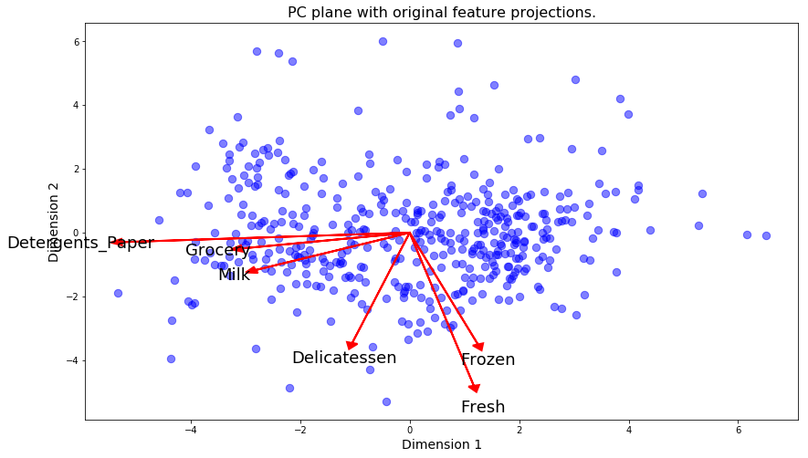
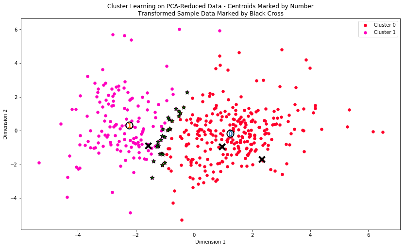
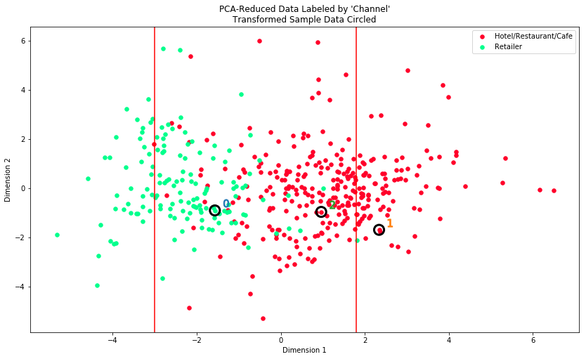

# Creating Customer Segments

## Introduction

In this project, I analyze a dataset containing data on various customers' annual spending amounts (reported in *monetary units*) of diverse product categories for internal structure. One goal of this project is to best describe the variation in the different types of customers that a wholesale distributor interacts with. Doing so would equip the distributor with insight into how to best structure their delivery service to meet the needs of each customer.

The dataset for this project can be found on the [UCI Machine Learning Repository](https://archive.ics.uci.edu/ml/datasets/Wholesale+customers). For the purposes of this project, the features `'Channel'` and `'Region'` will be excluded in the analysis — with focus instead on the six product categories recorded for customers.


```python
# Import libraries necessary for this project
import numpy as np
import pandas as pd
import matplotlib.pyplot as plt
from matplotlib import cm as cm
from IPython.display import display # Allows the use of display() for DataFrames

# Import supplementary visualizations code visuals.py
import visuals as vs

# Pretty display for notebooks
%matplotlib inline

# Load the wholesale customers dataset
try:
    data = pd.read_csv("customers.csv")
    data.drop(['Region', 'Channel'], axis = 1, inplace=True)
    print("Wholesale customers dataset has {} samples with {} features each.".format(*data.shape))
except:
    print "Dataset could not be loaded. Is the dataset missing?"
```

    Wholesale customers dataset has 440 samples with 6 features each.


## Data Exploration
In this section, I begin exploring the data through visualizations and code to understand how each feature is related to the others. I observe a statistical description of the dataset, consider the relevance of each feature, and select a few sample data points from the dataset which will be tracked throughout the project.


```python
# Display a description of the dataset
display(data.describe())
```


<div>
<table border="1" class="dataframe">
  <thead>
    <tr style="text-align: right;">
      <th></th>
      <th>Fresh</th>
      <th>Milk</th>
      <th>Grocery</th>
      <th>Frozen</th>
      <th>Detergents_Paper</th>
      <th>Delicatessen</th>
    </tr>
  </thead>
  <tbody>
    <tr>
      <th>count</th>
      <td>440.000000</td>
      <td>440.000000</td>
      <td>440.000000</td>
      <td>440.000000</td>
      <td>440.000000</td>
      <td>440.000000</td>
    </tr>
    <tr>
      <th>mean</th>
      <td>12000.297727</td>
      <td>5796.265909</td>
      <td>7951.277273</td>
      <td>3071.931818</td>
      <td>2881.493182</td>
      <td>1524.870455</td>
    </tr>
    <tr>
      <th>std</th>
      <td>12647.328865</td>
      <td>7380.377175</td>
      <td>9503.162829</td>
      <td>4854.673333</td>
      <td>4767.854448</td>
      <td>2820.105937</td>
    </tr>
    <tr>
      <th>min</th>
      <td>3.000000</td>
      <td>55.000000</td>
      <td>3.000000</td>
      <td>25.000000</td>
      <td>3.000000</td>
      <td>3.000000</td>
    </tr>
    <tr>
      <th>25%</th>
      <td>3127.750000</td>
      <td>1533.000000</td>
      <td>2153.000000</td>
      <td>742.250000</td>
      <td>256.750000</td>
      <td>408.250000</td>
    </tr>
    <tr>
      <th>50%</th>
      <td>8504.000000</td>
      <td>3627.000000</td>
      <td>4755.500000</td>
      <td>1526.000000</td>
      <td>816.500000</td>
      <td>965.500000</td>
    </tr>
    <tr>
      <th>75%</th>
      <td>16933.750000</td>
      <td>7190.250000</td>
      <td>10655.750000</td>
      <td>3554.250000</td>
      <td>3922.000000</td>
      <td>1820.250000</td>
    </tr>
    <tr>
      <th>max</th>
      <td>112151.000000</td>
      <td>73498.000000</td>
      <td>92780.000000</td>
      <td>60869.000000</td>
      <td>40827.000000</td>
      <td>47943.000000</td>
    </tr>
  </tbody>
</table>
</div>


- The first statistical feature that I notice in the description above is the large disparity between the means and medians for each product category. Considering the means are much larger than the medians, this leads me to conclude that there is heavy positive skew in the data. This can also be seen in maximum values that are far larger than their respective third quartile boundaries. A small number of customers that made outsize orders is likely the cause of this phenomenon. Morever, the standard deviations are larger than the means for all categories, rendering them illogical under normal distribution assumptions. With this noted, the median and quartile values are thus much more valuable at this point for describing and interpreting sample points in the dataset, so I will incorporate them into the discussion below.

### Selecting Samples
To get a better understanding of the customers and how their data will transform through the analysis, it would be best to select a few sample data points and explore them in more detail. I cycled through different sets of samples until I obtained customers that varied significantly from one another.


```python
# Select three indices to sample from the dataset
indices = [7,70,296]

# Create a DataFrame of the chosen samples
samples = pd.DataFrame(data.loc[indices], columns = data.keys()).reset_index(drop=True)
print("Chosen samples of wholesale customers dataset:")
display(samples)
```

    Chosen samples of wholesale customers dataset:


<div>
<table border="1" class="dataframe">
  <thead>
    <tr style="text-align: right;">
      <th></th>
      <th>Fresh</th>
      <th>Milk</th>
      <th>Grocery</th>
      <th>Frozen</th>
      <th>Detergents_Paper</th>
      <th>Delicatessen</th>
    </tr>
  </thead>
  <tbody>
    <tr>
      <th>0</th>
      <td>7579</td>
      <td>4956</td>
      <td>9426</td>
      <td>1669</td>
      <td>3321</td>
      <td>2566</td>
    </tr>
    <tr>
      <th>1</th>
      <td>16705</td>
      <td>2037</td>
      <td>3202</td>
      <td>10643</td>
      <td>116</td>
      <td>1365</td>
    </tr>
    <tr>
      <th>2</th>
      <td>19087</td>
      <td>1304</td>
      <td>3643</td>
      <td>3045</td>
      <td>710</td>
      <td>898</td>
    </tr>
  </tbody>
</table>
</div>


###### Characterizing the Establisments

**1.)** What is most interesting about the first establishment is that it doesn't order an exceptionally low amount of anything. Whereas the other two establishments have a least one order category with a value placed in the first quartile, this customer's orders across the board place in their 2nd quartiles or higher. Most noteworthy among them is `Delicatessen`, with a value in its top quartile. Other significant orders include `Grocery` and `Detergents_Paper`. What these three goods have in common is long shelf lives, indicating that this customer may be ordering a large volume of each of them on an irregular basis and stocking them for an extended period of time while reselling them further down the line to its own customers. Even without an absolute idea of what "monetary units" were used in creating this data, it is still obvious that one customer cannot consume such an amount of `Detergents_Paper` itself. In reality, this customer is purchasing mainly with the intent to build inventories. Based on this assessment, I classify this establishment as a retailer. The large order of `Grocery` clarifies that this retailer is likely a supermarket that primarily sells preprocessed and prepackaged foods, cleaning products, and miscellaneous items for the home.

**2.)** The most outstanding order for the second establishment is `Frozen`, placed well inside the 4th quartile with an order size of 10,643. This customer has notable orders of `Fresh` and `Delicatessen` as well, which both rank in their respective 3rd quartiles. Its orders in `Milk` and `Grocery` are just ordinary and typical for any restaurant. This is most likely a 2 or 3 star restaurant or pizzeria whose menu consists of items prepared with mostly frozen ingredients. They keep a large freezer that holds the majority of their product, but also regularly use fresh vegetables and meats in their dishes, which probably include pizza, pastas, sandwiches, etc. Because this restaurant isn't especially interested in investing much in cleanliness and upkeep, it doesn't need to order much `Detergents_Paper`. Its order in this category - a mere 116 - ranks it at the very bottom in its 1st quartile. It doesn't get much lower than this.

**3.)** `Fresh` is the most significant order category for the last establishment, with an order solidly inside the top quartile. The customer's `Frozen` order also features in its own 3rd quartile - enough to warrant consideration, albeit not near to the extent of the second customer. It orders a moderate amount of the other products (`Grocery`, `Detergents_Paper`, `Delicatessen`), with a particularly weak showing in `Milk`, falling in its own first quartile. My interpretation is that this customer is a restaurant as well, although one that serves more high-quality fresh food than the second one. Whereas the former prepares most of its items using frozen ingredients, the current instead prepares its dishes from scratch with mostly fresh ingredients. If the former scores 2 or 3 stars, then this one would likely score 4 or 5. Furthermore, in order to make sure that the dishes, silverware, kitchen, and restaurant in general are clean at all times, this restaurant orders a hefty volume of `Detergents_Paper`, however not enough that they could resell to customers, as the first establishment could. One would expect this level of attention to sanitation and hygiene in an upscale restaurant.

### Feature Relevance
One interesting thought to consider is if one (or more) of the six product categories is actually relevant for understanding customer purchasing. That is to say, is it possible to determine whether customers purchasing some amount of one category of products will necessarily purchase some proportional amount of another category of products? This determination can be made quite easily by training a supervised regression learner on a subset of the data with one feature removed, and then score how well that model can predict the removed feature.


```python
from sklearn.model_selection import train_test_split
from sklearn.tree import DecisionTreeRegressor

# Set random seed to allow reproducible results
np.random.seed(42)

# Make a copy of the DataFrame
# Use the 'drop' function to drop a given feature
new_data = data.copy()
new_data.drop(['Grocery'], axis = 1, inplace=True)

# Split the data into training and testing sets using the given feature as the target
X_train, X_test, y_train, y_test = train_test_split(new_data, data['Grocery'], 
                                                    test_size=0.25, random_state=42)

# Create a decision tree regressor and fit it to the training set
regressor = DecisionTreeRegressor()
regressor.fit(X_train,y_train)

# Report the score of the prediction using the testing set
score = regressor.score(X_test,y_test)
print "The decision tree regressor's r2_score is: {:.4f}".format(score)
```

    The decision tree regressor's r2_score is: 0.6819


- I attempted to predict the `Grocery` feature as a target using the other features as estimators. The default decision tree regressor output an `R^2` of 0.6819, which in my view is significant enough to warrant further consideration. Specifically, the other five features can explain roughly 70% of the variation in grocery purchases even without model tuning. Using grid search or other model optimization methods, this score could likely be boosted even further, but that was not the main purpose of this exercise. Based on this discovery, I believe that `Grocery` to no small extent is a function of the other five features. `Grocery` is not necessary for identifying customers' spending habits because most of its predictive power can be expressed without it. Going further, the remaining features can explain 50% and 17% of the variation in `Detergents_Paper` and `Milk` respectively. I hypothesis that combining these features with `Grocery` into a new macro-feature would help to shrink dimensionality while minimizing information loss, at least compared with combining `Fresh`, `Frozen`, and `Delicatessen`. Attempting to predict these features generates negative `R^2`, which is what gave me this insight.

### Visualize Feature Distributions
To get a better understanding of the dataset, I construct a scatter matrix of each of the six product features present in the data. If I find that the feature I attempted to predict above is relevant for identifying a specific customer, then the scatter matrix below may not show any correlation between that feature and the others. Conversely, a feature is not relevant for identifying a specific customer, the scatter matrix might show a correlation between that feature and another feature in the data.


```python
# Produce a scatter matrix for each pair of features in the data
pd.plotting.scatter_matrix(data, alpha = 0.3, figsize = (14,8), diagonal = 'kde');

# A more colorful visualization that allows for more convenient intepretation
# Taken, with modifications, from http://datascience.stackexchange.com/questions/10459/calculation-and-visualization-of-correlation-matrix-with-pandas
fig = plt.figure()
fig.set_size_inches(10, 10)
ax1 = fig.add_subplot(111)
cmap = cm.get_cmap('jet', 30)
cax = ax1.imshow(data.corr(), interpolation="nearest", cmap=cmap)
ax1.grid(True)
plt.title('Customer Spending Feature Correlation')
labels=['Placeholder','Fresh','Milk','Grocery','Frozen','Deterg./Paper','Deli.']
ax1.set_xticklabels(labels, fontsize=12)
ax1.set_yticklabels(labels, fontsize=12)
cbar = fig.colorbar(cax, ticks= np.linspace(0.0,1.0,5))
plt.show()

# Precise numeric breakdown
display(data.corr())
```








<div>
<table border="1" class="dataframe">
  <thead>
    <tr style="text-align: right;">
      <th></th>
      <th>Fresh</th>
      <th>Milk</th>
      <th>Grocery</th>
      <th>Frozen</th>
      <th>Detergents_Paper</th>
      <th>Delicatessen</th>
    </tr>
  </thead>
  <tbody>
    <tr>
      <th>Fresh</th>
      <td>1.000000</td>
      <td>0.100510</td>
      <td>-0.011854</td>
      <td>0.345881</td>
      <td>-0.101953</td>
      <td>0.244690</td>
    </tr>
    <tr>
      <th>Milk</th>
      <td>0.100510</td>
      <td>1.000000</td>
      <td>0.728335</td>
      <td>0.123994</td>
      <td>0.661816</td>
      <td>0.406368</td>
    </tr>
    <tr>
      <th>Grocery</th>
      <td>-0.011854</td>
      <td>0.728335</td>
      <td>1.000000</td>
      <td>-0.040193</td>
      <td>0.924641</td>
      <td>0.205497</td>
    </tr>
    <tr>
      <th>Frozen</th>
      <td>0.345881</td>
      <td>0.123994</td>
      <td>-0.040193</td>
      <td>1.000000</td>
      <td>-0.131525</td>
      <td>0.390947</td>
    </tr>
    <tr>
      <th>Detergents_Paper</th>
      <td>-0.101953</td>
      <td>0.661816</td>
      <td>0.924641</td>
      <td>-0.131525</td>
      <td>1.000000</td>
      <td>0.069291</td>
    </tr>
    <tr>
      <th>Delicatessen</th>
      <td>0.244690</td>
      <td>0.406368</td>
      <td>0.205497</td>
      <td>0.390947</td>
      <td>0.069291</td>
      <td>1.000000</td>
    </tr>
  </tbody>
</table>
</div>


###### Conclusions on Correlations

- The following pairs of features exhibit a high degree of correlation, in order from greatest to least: `Grocery` and `Detergents_Paper`; `Grocery` and `Milk`, and `Detergents_Paper` and `Milk`. To be more precise, the correlation coefficients for these pairs are 0.924641, 0.728335, and 0.661816 respectively. This supports my previous claim that these three features are not orthonormal and individually significant in predicting customer spending habits. A new insight that this analysis does give is that while the features are highly correlated with each other, they are not particularly correlated with the other three features (`Fresh`, `Frozen`, and `Delicatessen`. This is especially true for `Detergents_Paper` and `Grocery`. This indicates that instead of discarding the three features outright, they should be "repackaged" into a new one that captures the information they contain. This new feature could maintain the predictive strength that they possess as a group, without being redundant.


- The data for all features exhibits extreme positive skew, shown in the distribution plots. This was also evident in the median and mean calculations, which show mean values far in excess of the median for each feature - a tell-tale indicator of positive skew. The interpretation is that the majority of the samples consists of minor customers that purchase relatively small amounts of product, with a few major customers that buy in bulk spread throughout. My intuition tells me that the former group are mostly small businesses such as restaurants and convenience stores, while the latter are perhaps big-box retail warehouses.

## Data Preprocessing
In this section, I preprocess the data to create a better representation of customers by performing a scaling on the data and detecting and removing outliers. Preprocessing data is often times a critical step in assuring that results obtained from analysis are significant and meaningful.

### Feature Scaling
If data is not normally distributed, especially if the mean and median vary significantly (indicating a large skew), it is most [often appropriate](http://econbrowser.com/archives/2014/02/use-of-logarithms-in-economics) to apply a non-linear scaling. One way to achieve this scaling is by using a [Box-Cox test](http://scipy.github.io/devdocs/generated/scipy.stats.boxcox.html), which calculates the best power transformation of the data that reduces skewness. A simpler approach which can work in most cases would be applying the natural logarithm.


```python
# Scale the data using the natural logarithm
log_data = np.log(data)

# Scale the sample data using the natural logarithm
log_samples = np.log(samples)

# Produce a scatter matrix for each pair of newly-transformed features
pd.plotting.scatter_matrix(log_data, alpha = 0.3, figsize = (14,8), diagonal = 'kde');

# Numeric visualization
display(data.corr())
```


<div>
<table border="1" class="dataframe">
  <thead>
    <tr style="text-align: right;">
      <th></th>
      <th>Fresh</th>
      <th>Milk</th>
      <th>Grocery</th>
      <th>Frozen</th>
      <th>Detergents_Paper</th>
      <th>Delicatessen</th>
    </tr>
  </thead>
  <tbody>
    <tr>
      <th>Fresh</th>
      <td>1.000000</td>
      <td>0.100510</td>
      <td>-0.011854</td>
      <td>0.345881</td>
      <td>-0.101953</td>
      <td>0.244690</td>
    </tr>
    <tr>
      <th>Milk</th>
      <td>0.100510</td>
      <td>1.000000</td>
      <td>0.728335</td>
      <td>0.123994</td>
      <td>0.661816</td>
      <td>0.406368</td>
    </tr>
    <tr>
      <th>Grocery</th>
      <td>-0.011854</td>
      <td>0.728335</td>
      <td>1.000000</td>
      <td>-0.040193</td>
      <td>0.924641</td>
      <td>0.205497</td>
    </tr>
    <tr>
      <th>Frozen</th>
      <td>0.345881</td>
      <td>0.123994</td>
      <td>-0.040193</td>
      <td>1.000000</td>
      <td>-0.131525</td>
      <td>0.390947</td>
    </tr>
    <tr>
      <th>Detergents_Paper</th>
      <td>-0.101953</td>
      <td>0.661816</td>
      <td>0.924641</td>
      <td>-0.131525</td>
      <td>1.000000</td>
      <td>0.069291</td>
    </tr>
    <tr>
      <th>Delicatessen</th>
      <td>0.244690</td>
      <td>0.406368</td>
      <td>0.205497</td>
      <td>0.390947</td>
      <td>0.069291</td>
      <td>1.000000</td>
    </tr>
  </tbody>
</table>
</div>





### Observation
After applying a natural logarithm scaling to the data, the distribution of each feature appears much more normal. Correlations between various pairs of features is still clearly evident after the log transform.


```python
# Display the log-transformed sample data
display(log_samples)
```


<div>
<table border="1" class="dataframe">
  <thead>
    <tr style="text-align: right;">
      <th></th>
      <th>Fresh</th>
      <th>Milk</th>
      <th>Grocery</th>
      <th>Frozen</th>
      <th>Detergents_Paper</th>
      <th>Delicatessen</th>
    </tr>
  </thead>
  <tbody>
    <tr>
      <th>0</th>
      <td>8.933137</td>
      <td>8.508354</td>
      <td>9.151227</td>
      <td>7.419980</td>
      <td>8.108021</td>
      <td>7.850104</td>
    </tr>
    <tr>
      <th>1</th>
      <td>9.723463</td>
      <td>7.619233</td>
      <td>8.071531</td>
      <td>9.272658</td>
      <td>4.753590</td>
      <td>7.218910</td>
    </tr>
    <tr>
      <th>2</th>
      <td>9.856763</td>
      <td>7.173192</td>
      <td>8.200563</td>
      <td>8.021256</td>
      <td>6.565265</td>
      <td>6.800170</td>
    </tr>
  </tbody>
</table>
</div>


###  Outlier Detection
Detecting outliers in the data is extremely important in the data preprocessing step of any analysis. The presence of outliers can often skew results which take into consideration these data points. There are many "rules of thumb" for what constitutes an outlier in a dataset. Here, I use [Tukey's Method for identfying outliers](http://datapigtechnologies.com/blog/index.php/highlighting-outliers-in-your-data-with-the-tukey-method/): An *outlier step* is calculated as 1.5 times the interquartile range (IQR). A data point with a feature that is beyond an outlier step outside of the IQR for that feature is considered abnormal.


```python
# For each feature find the data points with extreme high or low values
for feature in log_data.keys():
    
    # Calculate Q1 (25th percentile of the data) for the given feature
    # Calculate Q3 (75th percentile of the data) for the given feature
   
    Q1, Q3 = np.percentile(log_data[feature], 25), np.percentile(log_data[feature], 75)
     
    # Use the interquartile range to calculate an outlier step (1.5 times the interquartile range)
    step = 1.5 * (Q3 - Q1)
    
    # Display the outliers
    print("Data points considered outliers for the feature '{}':".format(feature))
    display(log_data[~((log_data[feature] >= Q1 - step) & (log_data[feature] <= Q3 + step))])
    
# Select the indices for data points to be removed
outliers  = [65,66,75,128,154]

# Remove the outliers, if any were specified
good_data = log_data.drop(log_data.index[outliers]).reset_index(drop=True)
```

    Data points considered outliers for the feature 'Fresh':


<div>
<table border="1" class="dataframe">
  <thead>
    <tr style="text-align: right;">
      <th></th>
      <th>Fresh</th>
      <th>Milk</th>
      <th>Grocery</th>
      <th>Frozen</th>
      <th>Detergents_Paper</th>
      <th>Delicatessen</th>
    </tr>
  </thead>
  <tbody>
    <tr>
      <th>65</th>
      <td>4.442651</td>
      <td>9.950323</td>
      <td>10.732651</td>
      <td>3.583519</td>
      <td>10.095388</td>
      <td>7.260523</td>
    </tr>
    <tr>
      <th>66</th>
      <td>2.197225</td>
      <td>7.335634</td>
      <td>8.911530</td>
      <td>5.164786</td>
      <td>8.151333</td>
      <td>3.295837</td>
    </tr>
    <tr>
      <th>81</th>
      <td>5.389072</td>
      <td>9.163249</td>
      <td>9.575192</td>
      <td>5.645447</td>
      <td>8.964184</td>
      <td>5.049856</td>
    </tr>
    <tr>
      <th>95</th>
      <td>1.098612</td>
      <td>7.979339</td>
      <td>8.740657</td>
      <td>6.086775</td>
      <td>5.407172</td>
      <td>6.563856</td>
    </tr>
    <tr>
      <th>96</th>
      <td>3.135494</td>
      <td>7.869402</td>
      <td>9.001839</td>
      <td>4.976734</td>
      <td>8.262043</td>
      <td>5.379897</td>
    </tr>
    <tr>
      <th>128</th>
      <td>4.941642</td>
      <td>9.087834</td>
      <td>8.248791</td>
      <td>4.955827</td>
      <td>6.967909</td>
      <td>1.098612</td>
    </tr>
    <tr>
      <th>171</th>
      <td>5.298317</td>
      <td>10.160530</td>
      <td>9.894245</td>
      <td>6.478510</td>
      <td>9.079434</td>
      <td>8.740337</td>
    </tr>
    <tr>
      <th>193</th>
      <td>5.192957</td>
      <td>8.156223</td>
      <td>9.917982</td>
      <td>6.865891</td>
      <td>8.633731</td>
      <td>6.501290</td>
    </tr>
    <tr>
      <th>218</th>
      <td>2.890372</td>
      <td>8.923191</td>
      <td>9.629380</td>
      <td>7.158514</td>
      <td>8.475746</td>
      <td>8.759669</td>
    </tr>
    <tr>
      <th>304</th>
      <td>5.081404</td>
      <td>8.917311</td>
      <td>10.117510</td>
      <td>6.424869</td>
      <td>9.374413</td>
      <td>7.787382</td>
    </tr>
    <tr>
      <th>305</th>
      <td>5.493061</td>
      <td>9.468001</td>
      <td>9.088399</td>
      <td>6.683361</td>
      <td>8.271037</td>
      <td>5.351858</td>
    </tr>
    <tr>
      <th>338</th>
      <td>1.098612</td>
      <td>5.808142</td>
      <td>8.856661</td>
      <td>9.655090</td>
      <td>2.708050</td>
      <td>6.309918</td>
    </tr>
    <tr>
      <th>353</th>
      <td>4.762174</td>
      <td>8.742574</td>
      <td>9.961898</td>
      <td>5.429346</td>
      <td>9.069007</td>
      <td>7.013016</td>
    </tr>
    <tr>
      <th>355</th>
      <td>5.247024</td>
      <td>6.588926</td>
      <td>7.606885</td>
      <td>5.501258</td>
      <td>5.214936</td>
      <td>4.844187</td>
    </tr>
    <tr>
      <th>357</th>
      <td>3.610918</td>
      <td>7.150701</td>
      <td>10.011086</td>
      <td>4.919981</td>
      <td>8.816853</td>
      <td>4.700480</td>
    </tr>
    <tr>
      <th>412</th>
      <td>4.574711</td>
      <td>8.190077</td>
      <td>9.425452</td>
      <td>4.584967</td>
      <td>7.996317</td>
      <td>4.127134</td>
    </tr>
  </tbody>
</table>
</div>


    Data points considered outliers for the feature 'Milk':


<div>
<table border="1" class="dataframe">
  <thead>
    <tr style="text-align: right;">
      <th></th>
      <th>Fresh</th>
      <th>Milk</th>
      <th>Grocery</th>
      <th>Frozen</th>
      <th>Detergents_Paper</th>
      <th>Delicatessen</th>
    </tr>
  </thead>
  <tbody>
    <tr>
      <th>86</th>
      <td>10.039983</td>
      <td>11.205013</td>
      <td>10.377047</td>
      <td>6.894670</td>
      <td>9.906981</td>
      <td>6.805723</td>
    </tr>
    <tr>
      <th>98</th>
      <td>6.220590</td>
      <td>4.718499</td>
      <td>6.656727</td>
      <td>6.796824</td>
      <td>4.025352</td>
      <td>4.882802</td>
    </tr>
    <tr>
      <th>154</th>
      <td>6.432940</td>
      <td>4.007333</td>
      <td>4.919981</td>
      <td>4.317488</td>
      <td>1.945910</td>
      <td>2.079442</td>
    </tr>
    <tr>
      <th>356</th>
      <td>10.029503</td>
      <td>4.897840</td>
      <td>5.384495</td>
      <td>8.057377</td>
      <td>2.197225</td>
      <td>6.306275</td>
    </tr>
  </tbody>
</table>
</div>


    Data points considered outliers for the feature 'Grocery':


<div>
<table border="1" class="dataframe">
  <thead>
    <tr style="text-align: right;">
      <th></th>
      <th>Fresh</th>
      <th>Milk</th>
      <th>Grocery</th>
      <th>Frozen</th>
      <th>Detergents_Paper</th>
      <th>Delicatessen</th>
    </tr>
  </thead>
  <tbody>
    <tr>
      <th>75</th>
      <td>9.923192</td>
      <td>7.036148</td>
      <td>1.098612</td>
      <td>8.390949</td>
      <td>1.098612</td>
      <td>6.882437</td>
    </tr>
    <tr>
      <th>154</th>
      <td>6.432940</td>
      <td>4.007333</td>
      <td>4.919981</td>
      <td>4.317488</td>
      <td>1.945910</td>
      <td>2.079442</td>
    </tr>
  </tbody>
</table>
</div>


    Data points considered outliers for the feature 'Frozen':


<div>
<table border="1" class="dataframe">
  <thead>
    <tr style="text-align: right;">
      <th></th>
      <th>Fresh</th>
      <th>Milk</th>
      <th>Grocery</th>
      <th>Frozen</th>
      <th>Detergents_Paper</th>
      <th>Delicatessen</th>
    </tr>
  </thead>
  <tbody>
    <tr>
      <th>38</th>
      <td>8.431853</td>
      <td>9.663261</td>
      <td>9.723703</td>
      <td>3.496508</td>
      <td>8.847360</td>
      <td>6.070738</td>
    </tr>
    <tr>
      <th>57</th>
      <td>8.597297</td>
      <td>9.203618</td>
      <td>9.257892</td>
      <td>3.637586</td>
      <td>8.932213</td>
      <td>7.156177</td>
    </tr>
    <tr>
      <th>65</th>
      <td>4.442651</td>
      <td>9.950323</td>
      <td>10.732651</td>
      <td>3.583519</td>
      <td>10.095388</td>
      <td>7.260523</td>
    </tr>
    <tr>
      <th>145</th>
      <td>10.000569</td>
      <td>9.034080</td>
      <td>10.457143</td>
      <td>3.737670</td>
      <td>9.440738</td>
      <td>8.396155</td>
    </tr>
    <tr>
      <th>175</th>
      <td>7.759187</td>
      <td>8.967632</td>
      <td>9.382106</td>
      <td>3.951244</td>
      <td>8.341887</td>
      <td>7.436617</td>
    </tr>
    <tr>
      <th>264</th>
      <td>6.978214</td>
      <td>9.177714</td>
      <td>9.645041</td>
      <td>4.110874</td>
      <td>8.696176</td>
      <td>7.142827</td>
    </tr>
    <tr>
      <th>325</th>
      <td>10.395650</td>
      <td>9.728181</td>
      <td>9.519735</td>
      <td>11.016479</td>
      <td>7.148346</td>
      <td>8.632128</td>
    </tr>
    <tr>
      <th>420</th>
      <td>8.402007</td>
      <td>8.569026</td>
      <td>9.490015</td>
      <td>3.218876</td>
      <td>8.827321</td>
      <td>7.239215</td>
    </tr>
    <tr>
      <th>429</th>
      <td>9.060331</td>
      <td>7.467371</td>
      <td>8.183118</td>
      <td>3.850148</td>
      <td>4.430817</td>
      <td>7.824446</td>
    </tr>
    <tr>
      <th>439</th>
      <td>7.932721</td>
      <td>7.437206</td>
      <td>7.828038</td>
      <td>4.174387</td>
      <td>6.167516</td>
      <td>3.951244</td>
    </tr>
  </tbody>
</table>
</div>


    Data points considered outliers for the feature 'Detergents_Paper':


<div>
<table border="1" class="dataframe">
  <thead>
    <tr style="text-align: right;">
      <th></th>
      <th>Fresh</th>
      <th>Milk</th>
      <th>Grocery</th>
      <th>Frozen</th>
      <th>Detergents_Paper</th>
      <th>Delicatessen</th>
    </tr>
  </thead>
  <tbody>
    <tr>
      <th>75</th>
      <td>9.923192</td>
      <td>7.036148</td>
      <td>1.098612</td>
      <td>8.390949</td>
      <td>1.098612</td>
      <td>6.882437</td>
    </tr>
    <tr>
      <th>161</th>
      <td>9.428190</td>
      <td>6.291569</td>
      <td>5.645447</td>
      <td>6.995766</td>
      <td>1.098612</td>
      <td>7.711101</td>
    </tr>
  </tbody>
</table>
</div>


    Data points considered outliers for the feature 'Delicatessen':


<div>
<table border="1" class="dataframe">
  <thead>
    <tr style="text-align: right;">
      <th></th>
      <th>Fresh</th>
      <th>Milk</th>
      <th>Grocery</th>
      <th>Frozen</th>
      <th>Detergents_Paper</th>
      <th>Delicatessen</th>
    </tr>
  </thead>
  <tbody>
    <tr>
      <th>66</th>
      <td>2.197225</td>
      <td>7.335634</td>
      <td>8.911530</td>
      <td>5.164786</td>
      <td>8.151333</td>
      <td>3.295837</td>
    </tr>
    <tr>
      <th>109</th>
      <td>7.248504</td>
      <td>9.724899</td>
      <td>10.274568</td>
      <td>6.511745</td>
      <td>6.728629</td>
      <td>1.098612</td>
    </tr>
    <tr>
      <th>128</th>
      <td>4.941642</td>
      <td>9.087834</td>
      <td>8.248791</td>
      <td>4.955827</td>
      <td>6.967909</td>
      <td>1.098612</td>
    </tr>
    <tr>
      <th>137</th>
      <td>8.034955</td>
      <td>8.997147</td>
      <td>9.021840</td>
      <td>6.493754</td>
      <td>6.580639</td>
      <td>3.583519</td>
    </tr>
    <tr>
      <th>142</th>
      <td>10.519646</td>
      <td>8.875147</td>
      <td>9.018332</td>
      <td>8.004700</td>
      <td>2.995732</td>
      <td>1.098612</td>
    </tr>
    <tr>
      <th>154</th>
      <td>6.432940</td>
      <td>4.007333</td>
      <td>4.919981</td>
      <td>4.317488</td>
      <td>1.945910</td>
      <td>2.079442</td>
    </tr>
    <tr>
      <th>183</th>
      <td>10.514529</td>
      <td>10.690808</td>
      <td>9.911952</td>
      <td>10.505999</td>
      <td>5.476464</td>
      <td>10.777768</td>
    </tr>
    <tr>
      <th>184</th>
      <td>5.789960</td>
      <td>6.822197</td>
      <td>8.457443</td>
      <td>4.304065</td>
      <td>5.811141</td>
      <td>2.397895</td>
    </tr>
    <tr>
      <th>187</th>
      <td>7.798933</td>
      <td>8.987447</td>
      <td>9.192075</td>
      <td>8.743372</td>
      <td>8.148735</td>
      <td>1.098612</td>
    </tr>
    <tr>
      <th>203</th>
      <td>6.368187</td>
      <td>6.529419</td>
      <td>7.703459</td>
      <td>6.150603</td>
      <td>6.860664</td>
      <td>2.890372</td>
    </tr>
    <tr>
      <th>233</th>
      <td>6.871091</td>
      <td>8.513988</td>
      <td>8.106515</td>
      <td>6.842683</td>
      <td>6.013715</td>
      <td>1.945910</td>
    </tr>
    <tr>
      <th>285</th>
      <td>10.602965</td>
      <td>6.461468</td>
      <td>8.188689</td>
      <td>6.948897</td>
      <td>6.077642</td>
      <td>2.890372</td>
    </tr>
    <tr>
      <th>289</th>
      <td>10.663966</td>
      <td>5.655992</td>
      <td>6.154858</td>
      <td>7.235619</td>
      <td>3.465736</td>
      <td>3.091042</td>
    </tr>
    <tr>
      <th>343</th>
      <td>7.431892</td>
      <td>8.848509</td>
      <td>10.177932</td>
      <td>7.283448</td>
      <td>9.646593</td>
      <td>3.610918</td>
    </tr>
  </tbody>
</table>
</div>


###### Addressing the Outliers

- There were six data points that were flagged as outliers for more than one feature. The indexes of these points are 65,66,75,128, and 154. Prior to making the decision to remove them or not, I thought about what else would need to be done to the data in later steps to achieve the goals of the project. Since PCA creates new feature axes based on the original ones that merely contain the most variation, it would not heavily be impacted by the outliers, especially with the data already in log form. On the other hand, outliers could have an undesirable effect on the GMM clustering algorithm that will be implemented after transforming the feature axes. Based on this, I made the decision to remove them primarily to optimize clustering.

## Feature Transformation
In this section I use principal component analysis (PCA) to draw conclusions about the underlying structure of the wholesale customer data. Since using PCA on a dataset calculates the dimensions which best maximize variance, I am looking for which compound combinations of features best describe customers.

###  PCA

Now that the data has been scaled to a more normal distribution and has had outliers removed, I can apply PCA to the `good_data` to discover which dimensions about the data best maximize the variance of features involved. In addition to finding these dimensions, PCA will also report the *explained variance ratio* of each dimension — how much variance within the data is explained by that dimension alone. Note that a component (dimension) from PCA can be considered a new "feature" of the space, however it is a composition of the original features present in the data.


```python
from sklearn.decomposition import PCA

# Apply PCA by fitting the good data with the same number of dimensions as features
pca = PCA()
pca.fit(good_data)

# Transform the sample log-data using the PCA fit above
pca_samples = pca.transform(log_samples)

# Generate PCA results plot
pca_results = vs.pca_results(good_data, pca)
```


###### PCA Analysis

- The first and second principal components explain a combined 70.68% of the variation in the dataset. If one includes the third and first component, this amount rises to 93.11%. 


- PC 1, composed primarily of `Detergents_Paper`, `Grocery`, and `Milk` represents prepacked goods that can easily be stocked on shelves and resold to consumers. This feature contains items that are meant to be used or consumed in isolation. The name for this feature could be "Packaged Goods." As products in `Fresh` and `Frozen` are commonly not consumed separately but instead jointly with other products, they have the same weight sign in this feature. PC 2, which consists of `Fresh`, `Frozen`, and `Delicatessen` represents food items that can be consumed either in isolation or in combination with one another. If one had to apply a name to this feature, it would be "Meals." For example, a Turkey sandwhich with fries is a meal that uses items from each of the three categories in the feature. Because `Milk`, `Grocery`, and `Detergents_Paper` (in the form of a napkin) are typically included in meals as well, all six original features have the same weight sign here.


- After the second principal component, interpretation becomes more confounded. A pattern that emerges however is that with each successive component, aspects of the data that the new features embody become more and more specific. As such, PC 1 is the most general and PC 6 is the most specific. The most outstanding aspect of the third component is the heavy negative weight assigned to `Fresh`. Perhaps this feature constitutes foods that have longer shelf lives than those captured in the second component. Even for those customers who order heavily in the "Meal" category defined previously, it is likely not the case that ALL of their orders need to be consumed immediately. Some can be stocked away and used at later dates. Cured meats (`Delicatessen`) and frozen pastries (`Frozen`), for example, would likely fall into such a new category. The negative weight on `Fresh`, which includes foods with very short shelf lives, makes sense with this interpretation as well. In the fourth component, `Frozen` stands tall above all the rest in its positive weight, while `Delicatessen` nearly balances it on the negative side. My interpretation of this feature is that it represents cheap food that can be stocked in refrigerators for long periods of time. In a sense, the fourth feature takes the third one and specializes it further. Whereas foods in `Delicatessen` are typically expensive and even luxurious sometimes, those in `Frozen` are usually processed and cheap. The first four principal components encapsulate variation in `Frozen` so well that it receives nearly no weight in the fifth and sixth components, as expected. 

### Observation
The code below shows how the log-transformed sample data has changed after having a PCA transformation applied to it in six dimensions. Observe the numerical value for the first four dimensions of the sample points.


```python
# Display sample log-data after having a PCA transformation applied
display(pd.DataFrame(np.round(pca_samples, 4), columns = pca_results.index.values))
```


<div>
<table border="1" class="dataframe">
  <thead>
    <tr style="text-align: right;">
      <th></th>
      <th>Dimension 1</th>
      <th>Dimension 2</th>
      <th>Dimension 3</th>
      <th>Dimension 4</th>
      <th>Dimension 5</th>
      <th>Dimension 6</th>
    </tr>
  </thead>
  <tbody>
    <tr>
      <th>0</th>
      <td>-1.5672</td>
      <td>-0.9010</td>
      <td>0.3684</td>
      <td>-0.2682</td>
      <td>-0.4571</td>
      <td>0.1526</td>
    </tr>
    <tr>
      <th>1</th>
      <td>2.3404</td>
      <td>-1.6911</td>
      <td>0.7155</td>
      <td>0.5932</td>
      <td>0.4606</td>
      <td>0.4074</td>
    </tr>
    <tr>
      <th>2</th>
      <td>0.9637</td>
      <td>-0.9607</td>
      <td>-0.4363</td>
      <td>0.1914</td>
      <td>-0.6969</td>
      <td>0.3937</td>
    </tr>
  </tbody>
</table>
</div>


### Dimensionality Reduction
When using principal component analysis, one of the main goals is to reduce the dimensionality of the data — in effect, reducing the complexity of the problem. Dimensionality reduction comes at a cost: Fewer dimensions used implies less of the total variance in the data is being explained. Because of this, the *cumulative explained variance ratio* is important for knowing how many dimensions are necessary for the problem. Additionally, if a significant amount of variance is explained by only two or three dimensions, the reduced data can be visualized afterwards.


```python
# Apply PCA by fitting the good data with only two dimensions
pca = PCA(n_components=2)
pca.fit(good_data)

# Transform the good data using the PCA fit above
reduced_data = pca.transform(good_data)

# Transform the sample log-data using the PCA fit above
pca_samples = pca.transform(log_samples)

# Create a DataFrame for the reduced data
reduced_data = pd.DataFrame(reduced_data, columns=['Dimension 1', 'Dimension 2'])
```

### Observation
The code below shows how the log-transformed sample data has changed after having a PCA transformation applied to it using only two dimensions. Observe how the values for the first two dimensions remain unchanged when compared to a PCA transformation in six dimensions.


```python
# Display sample log-data after applying PCA transformation in two dimensions
display(pd.DataFrame(np.round(pca_samples, 4), columns=['Dimension 1', 'Dimension 2']))
```


<div>
<table border="1" class="dataframe">
  <thead>
    <tr style="text-align: right;">
      <th></th>
      <th>Dimension 1</th>
      <th>Dimension 2</th>
    </tr>
  </thead>
  <tbody>
    <tr>
      <th>0</th>
      <td>-1.5672</td>
      <td>-0.9010</td>
    </tr>
    <tr>
      <th>1</th>
      <td>2.3404</td>
      <td>-1.6911</td>
    </tr>
    <tr>
      <th>2</th>
      <td>0.9637</td>
      <td>-0.9607</td>
    </tr>
  </tbody>
</table>
</div>


## Visualizing a Biplot
A biplot is a scatterplot where each data point is represented by its scores along the principal components. The axes are the principal components (in this case `Dimension 1` and `Dimension 2`). In addition, the biplot shows the projection of the original features along the components. A biplot can help to interpret the reduced dimensions of the data, and discover relationships between the principal components and original features.


```python
# Create a biplot
vs.biplot(good_data, reduced_data, pca)
```


    <matplotlib.axes._subplots.AxesSubplot at 0x110b69dd0>





### Biplot Observations

With the original feature projection in red, it is easier to interpret the relative position of each data point in the scatterplot. For instance, a point the upper left corner of the figure will likely correspond to a customer that spends a lot on `'Milk'`, `'Grocery'` and `'Detergents_Paper'`, but not so much on the other product categories. 

- In order from greatest to least, `Detergents_Paper`, `Grocery`, and `Milk`, have the the strongest correlation with the first principal component. In fact, `Detergent_Paper` is nearly parallel with the new axis, indicating almost perfect correlation. These results also make sense in terms of the pca_results plot as well as the correlation matrix displayed earlier which shows significant correlation between the three features. 


- `Fresh`, `Frozen`, and `Delicatessen` are most strongly correlated with the second principal component, however not to the great extent of the features in the first component. `Fresh` is clearly the most dominant feature, while `Frozen` and `Delicatessen` are roughly equal, however pointing in different directions. This observation also agrees with the pca_results plot that I obtained earlier, which shows `Fresh` with the highest weight and the other two features tied for second and third.

## Clustering

In this section, I employ the Gaussian Mixture Model clustering algorithm to identify the various customer segments inherent in the data. I then recover specific data points from the clusters to understand their significance by transforming them back into their original dimension and scale. 

###### The Case for Gaussian Mixture Models over K-Means

- Between K-Means and Gaussian Mixture Models, K-Means is more simple and easy to implement even for someone without a background in machine learning. By grouping data into globular shapes, K-Means produces clusters that often make intuitive sense. Of course if the clusters are not structured in this manner, then this benefit will be outweighed by K-Means' inability to capture alternative structures. K-Means establishes "hard clustering" which makes for easier interpretation as well: each data point belongs to one and only one cluster center. Through applying PCA and selecting a small number of clusters, K-Means can be computationally very fast as well. Time complexity scales linearly with the number of data points given a fixed cluster parameter.


- As mentioned, K-Means cannot model clusters that do not conform to spherical shapes. This is where the main advantage of Gaussian Mixture Models becomes apparent. GMMs can model clusters that take a variety of shapes, including those that are elongated or elliptical. GMM also allows mixed cluster membership by computing the probabilities that each data point belongs to each cluster. These two features make GMM a "soft clustering" approach that provides flexibility not granted in K-Means.


- Based on what I have observed, I've decided to use Gaussian Mixture Models to attempt to cluster the data. GMM assumes that data comes from two to `n_samples - 1` clusters (Gaussian distributions in this case) and assigns each data point to one of them based on probability. After log-transforming the data, the feature distributions appear approximately normal, which satisfies the Gaussian distribution assumption of GMM. Looking at the biplot, I can discern two rough clusters, but they are far from non-overlapping. The boundary between the two clusters is ambiguous at best, which makes a strong case for GMM. To demostrate this, I found 31 points in the data that GMM could not definitively classify into one of two clusters. The meaning of "definitive" here is subjective, but I define it as a point having greater than 60% probability of belonging to one of the clusters. I marked these points as green stars in the `cluster_results` plot as well. This clear distinction between "strong" and "weak" cluster members is not possible with K-Means, which makes it appear as though all cluster members belong equally, betraying the truth of the data. This reinforces why I chose to use GMM instead.

###  Creating Clusters
Depending on the problem, the number of clusters that one would expect to be in a dataset may already be known. When the number of clusters is not known *a priori*, there is no guarantee that a given number of clusters best segments the data, since it is unclear what structure exists in the data — if any. However, the "goodness" of a clustering the can be quantified by calculating each data point's *silhouette coefficient*. The [silhouette coefficient](http://scikit-learn.org/stable/modules/generated/sklearn.metrics.silhouette_score.html) for a data point measures how similar it is to its assigned cluster from -1 (dissimilar) to 1 (similar). Calculating the *mean* silhouette coefficient provides for a simple scoring method of a given clustering.


```python
from sklearn.mixture import GaussianMixture
from sklearn.metrics import silhouette_score

# Apply clustering algorithm to the reduced data 
clusterer = GaussianMixture(n_components=2, n_init=10, random_state=42)
clusterer.fit(reduced_data)

# Predict the cluster for each data point
preds = clusterer.predict(reduced_data)

# Find the cluster centers
centers = clusterer.means_

# Predict the cluster for each transformed sample data point
sample_preds = clusterer.predict(pca_samples)

# Calculate the mean silhouette coefficient for the number of clusters chosen
score = silhouette_score(reduced_data,preds)

print 'Silhouette score using GMM: {:.3f}'.format(score)
```

    Silhouette score using GMM: 0.422


The table below displays the silhouette scores associated with various GMM clustering setups:

| No. of Clusters | Silhouette Score |
| :---------------: | :---------------------: |
| 2               |        0.422          |
| 3               |        0.394          |
| 4               |        0.316          |
| 5               |        0.278          |
| 8               |        0.333          |
| 12              |        0.301          |
| 20              |        0.314          |
| 50              |        0.307          |

- `n_components=2` appears to be the optimal cluster size parameter for GMM with its silhouette score of 0.422. Furthermore, increasing the number of clusters does not appear to have a positive and consistent effect on the score, therefore two clusters was chosen as the optimal number of clusters.

### Cluster Visualization
With the optimal number of clusters chosen for the GMM clustering algorithm using the scoring metric above, I can now visualize the results by executing the code block below. For experimentation purposes, the number of clusters for GMM can be adjusted to see various visualizations. The visualization I've provided, however, corresponds with the optimal number of clusters.


```python
# Added some functionality to display points that don't neatly fall into either cluster.
probs = pd.DataFrame(clusterer.predict_proba(reduced_data))
border_indexes = np.array(probs[(probs[0] >= 0.4) & (probs[0] <= 0.6)].index)
border_data = reduced_data.values[border_indexes]
# Display the results of the clustering from implementation
vs.cluster_results(reduced_data, preds, centers, pca_samples, border_data)
```





### Data Recovery
Each cluster present in the visualization above has a central point. These centers (or means) are not specifically data points from the data, but rather the *averages* of all the data points predicted in the respective clusters. For the problem of creating customer segments, a cluster's center point corresponds to *the average customer of that segment*. Since the data is currently reduced in dimension and scaled by a logarithm, I recover the representative customer spending from these data points by applying the inverse transformations.


```python
# Inverse transform the centers
log_centers = pca.inverse_transform(centers)

# Exponentiate the centers
true_centers = np.exp(log_centers)

# Display the true centers
segments = ['Segment {}'.format(i) for i in range(0,len(centers))]
true_centers = pd.DataFrame(np.round(true_centers), columns = data.keys())
true_centers.index = segments
display(true_centers)
```


<div>
<table border="1" class="dataframe">
  <thead>
    <tr style="text-align: right;">
      <th></th>
      <th>Fresh</th>
      <th>Milk</th>
      <th>Grocery</th>
      <th>Frozen</th>
      <th>Detergents_Paper</th>
      <th>Delicatessen</th>
    </tr>
  </thead>
  <tbody>
    <tr>
      <th>Segment 0</th>
      <td>8953.0</td>
      <td>2114.0</td>
      <td>2765.0</td>
      <td>2075.0</td>
      <td>353.0</td>
      <td>732.0</td>
    </tr>
    <tr>
      <th>Segment 1</th>
      <td>3552.0</td>
      <td>7837.0</td>
      <td>12219.0</td>
      <td>870.0</td>
      <td>4696.0</td>
      <td>962.0</td>
    </tr>
  </tbody>
</table>
</div>


###### Cluster Interpretations 

- Comparing with the medians in the earlier statistical description, I can say that the true means that were extracted are much more reasonable than the previous means that were found prior to data processing. Below I compare the true means to the original quartiles to determine which product categories are most important to each segment. This helps to refine the kinds of customers that each segment contains so that I can speculate what each cluster represents. I note that `Delicatessen` is not very useful in demarcating the customer segments.


- Segment 0 represents small businesses. This category includes restaurants and farmers' markets who mainly order fresh and frozen food over the other product categories. Unlike Segment 1, they do not order large enough volumes of any product that they could reasonably resell directly to customers. Members of this segment are not bulk buyers, but instead use what they buy for their immediate needs. They buy small quantities of goods, use them as required, and likely need replenishing on a regular basis. Checking the true sales means of Segment 0 against the quartiles for each product, it can be seen that the average customer in this segment places in Q3, Q2, Q2, Q3, Q2, and Q2 for `Fresh`, `Milk`, `Grocery`, `Frozen`, `Detergents_Paper`, `Delicatessen` respectively. This further supports the assertion that `Fresh` and `Frozen` are most valuable categories for customers in Segment 0. These two categories are relatively more important to restaurants and farmers' markets compared to other kinds of establishments, giving additional support to the existence of this cluster.


- Segment 1 represents bulk buyers. Supermarkets, convenience stores, and retail warehouses would fall into this category. Their average orders in `Milk`, `Grocery`, and `Detergent_Papers` are so many multiples higher than those of Segment 0, that one can assume they are buying enough to resell directly to their constumers. These customers order moderate to large quantities of detergents, cleaners, groceries, and other goods, and stock them for extended periods of time. They likely do not have an urgent need for their products at any particular moment in time. Comparing this segment's true sales means to their respective quartiles shows that a typical customer's orders place in Q2, Q3, Q3, Q2, Q3, and Q2 for `Fresh`, `Milk`, `Grocery`, `Frozen`, `Detergents_Paper`, `Delicatessen` respectively. This demonstrates that `Milk`, `Grocery`, and `Detergents_Paper` are categories most integral to Segment 1. All of these products can be purchased in large quantities, stocked easily on shelves, and sold to consumers, validating the retail aspect of this cluster.

###### Sample Descriptions 


```python
# Display the predictions
for i, pred in enumerate(sample_preds):
    print "Sample point", i, "predicted to be in Cluster", pred

```

    Sample point 0 predicted to be in Cluster 1
    Sample point 1 predicted to be in Cluster 0
    Sample point 2 predicted to be in Cluster 0


- To help me classify the samples into the clusters generated by GMM, I devised the simple method outlined below. Each table displays the differences in the true centers for both segments and purchases by each sample. I interpret that the segment with the lowest distances is the one to which each sample belongs. According to this, Sample 0 should belong to Segment 1, while both Sample 1 and 2 should belong to Segment 0. This is consistent with the predictions generated above.


   ***Sample 0 Difference Table (True Centers - Customer Purchases)***

|| Fresh | Milk  | Grocery | Frozen | Detergents_Paper | Delicatessen
|:---------:| :---------: | :---------: | :----------: | :---------: | :---------: | :---------:
| **Segment 0** | 1233             |        2904          | 6737 | 389 | 2984 | 1854
| **Segment 1**| 3263             |        1391          | 129  | 633 | 275  | 1621

   ***Sample 1 Difference Table (True Centers - Customer Purchases)***

|| Fresh | Milk  | Grocery | Frozen | Detergents_Paper | Delicatessen
|:---------:| :---------: | :----------: | :---------: | :---------: | :---------: | :---------:
|**Segment 0**| 7893             |        15          | 513 | 8585 | 221 | 653
|**Segment 1**| 12389             |       4310          | 6353  | 9607 | 2930  | 420

   ***Sample 2 Difference Table (True Centers - Customer Purchases)***

|| Fresh | Milk  | Grocery | Frozen | Detergents_Paper | Delicatessen
|:---------:| :---------: | :---------: | :---------: | :---------: | :---------: | :---------:
|**Segment 0**| 10275             |        748          | 954 | 987 | 373 | 186
|**Segment 1**| 14771             |        5043          | 5912  | 2009 | 2336  | 47

## Conclusion

In this final section, I investigate ways that to make use of the clustered data. First, I discuss how the different groups of customers, the ***customer segments***, may be affected differently by a specific delivery scheme. Next, I consider how giving a label to each customer (which *segment* that customer belongs to) can provide for additional features about the customer data. Finally, I compare the ***customer segments*** to a hidden variable present in the data, to see whether the clustering identified certain relationships.

###### Example Scenario

Companies will often run [A/B tests](https://en.wikipedia.org/wiki/A/B_testing) when making small changes to their products or services to determine whether making that change will affect its customers positively or negatively. The wholesale distributor is considering changing its delivery service from currently 5 days a week to 3 days a week. However, the distributor will only make this change in delivery service for customers that react positively. 


- The change in delivery schedule from 5 days a week to 3 days a week certainly does not affect all customers equally, since is clear that the customers fall into one of two clusters, and therefore would reasonably react in one of two distinct manners to any change imposed upon them. How much a particular customer is affected depends on how representative it is of the particular cluster that it belongs too. After all, with an average silhouette score of only 0.412, the clusters are not incredibly distinct. The visualization further shows that the clusters are more loose than one would prefer. Within each cluster, there is a considerable degree of variance among the data points that it includes. In fact, there is likely moderate overlap between the two clusters that can obscure how a customer in a particular cluster would react to a change in the delivery service. The closer the customer is to the true center of its cluster, the more confident one can be in making a prediction. 


- To determine which customers would be affected the most by the change, the wholesale distributor can use the product sales averages at the true centers of the clusters to determine the product categories that are most important to each segment. Customers in Segment 0 order moderate volumes of `Fresh` and `Frozen` over the other categories, while those in Segment 1 order high volumes of `Detergents_Paper`, `Grocery`, and `Milk`. The differences between the two segments on `Delicatessen` is not as apparent, so this feature should be excluded from the analysis. Going off these observations, the distributor can predict that customers in Segment 0, who order goods with short expiry, need frequent and consistent deliveries in order to operate their businesses. These customers would benefit from the 5 days a week delivery schedule and would likely react negatively to switch to a 3 day schedule. On the other hand, customers in Segment 1 mainly order goods that do not have as tight expiration dates (with the exception of `Milk`). The goods they order can easily be shipped in bulk and stocked for extended periods of time. Those in this group would likely have an indifferent to positive reaction to the delivery schedule change. I float the possibility of positive because they might feel it is a hassle to have to deal with receiving shipments 5 days a week compared to 3 when the need to replenish their goods is not necessarily urgent. By receiving goods only 3 days per week, their employees can spend more time focusing on other more critical job tasks instead of wasting time receiving deliveries.

###### Handling New Customers

Additional structure is derived from originally unlabeled data when using clustering techniques. Since each customer has a ***customer segment*** it best identifies with (depending on the clustering algorithm applied), *'customer segment'* can be considered  as an **engineered feature** for the data. Consider the situation where the wholesale distributor recently acquired ten new customers and each provided estimates for anticipated annual spending of each product category. Knowing these estimates, the wholesale distributor could classify each new customer to a ***customer segment*** to determine the most appropriate delivery service. The details for how this could be handled are explained below.

- The wholesale distributor could modify the customer segment data by adding a new column labeled "Segment." In this column, customers would be labeled "Segment 0" or "Segment 1." To determine the labels, one could first apply PCA and GMM as I have done above and classify each customer using GMM's prediction as the target label. At this point, the distributor could use the data plus labels with two dimensions or the original six for training various supervised learning algorithms. I would recommend starting with decision trees or random forests as it appears that the data is approximately separable with vertical and horizontal hyperplanes. A variety of supervised algorithms should then be trained, cross-validated, and tested on the original data using optimization methods such as grid search and randomized search. When an optimal model is discovered, the distributor can provide it with data on the ten new customers and allow it to classify them into the two segments. He or she can also visualize the new customers by plotting them on the PCA feature axes to see if their labels are reasonable. Once again, the closer the new customers to the cluster centers, the more confident one can be in the labels that the model assigns.

### Visualizing Underlying Distributions

At the beginning of this project, it was discussed that the `'Channel'` and `'Region'` features would be excluded from the dataset so that the customer product categories were emphasized in the analysis. By reintroducing the `'Channel'` feature into the dataset, an interesting structure emerges when considering the same PCA dimensionality reduction applied earlier to the original dataset.

The code block belows assigns a label to each data point - either `'HoReCa'` (Hotel/Restaurant/Cafe) or `'Retail'` in the reduced space. In addition, the sample points are circled in the plot, which will identify their labeling.


```python
# Display the clustering results based on 'Channel' data
vs.channel_results(reduced_data, outliers, pca_samples)
```





###### Comparison of the Clustering Scheme and Labeled Data

- The number of clusters in the underlying distribution matches exactly what GMM determined. The general shape of the clusters matches the algorithm output reasonably as well, however there are a few key points of interest. For one, there's quite a bit of overlap between the customers as I expected. Overall, `HoReCa` has a larger distribution than `Retail`, which can be seen in how many red points enroach on the green space. `Retail` also spills over into the `HoReCa` space, but not as much as the other way around. GMM also predicted that Segment 1 'wraps' around the top of Segment 0, which seemed strange to me. The true distribution does not show such a pattern. Despite these features, `HoReCa` does appear to have a more well-defined center than `Retail`. One can visualize a circle surrouding its most dense portion that includes ~70% of its members. In determing what makes a 'pure' Hotel/Restaurant/Cafe, I would base this measure on how close a given customer is to the cluster center. 


- Another way to separate the 'pure' from the 'impure' would be to look at the axis of Dimension 1. Setting a vertical line at `Dimension_1 = 1.8` would separate the 'pure' Hotels/Restaurants/Cafes on the left from the rest of the data on the right, as seen in the modified plot. Likewise, a vertical line could be set at `Dimension_1 = -3` to divide 'pure' Retailers on the right from the rest of the data on the left. In my previous definition of customer segments, I placed heavy importance on whether or not the customer is ordering enough that it could resell product to further customers. The above analysis using variation on `Dimension_1` is consistent with this definition of the segments. Below -1.8, the customers are buying so little that they could not feasibly run a retail business. Above 3, they order so much that they have to resell it to stay in business. Everywhere in between is much more ambiguous, so I would be more restrained in making predictions about customers in this zone for which I didn't have labels.
